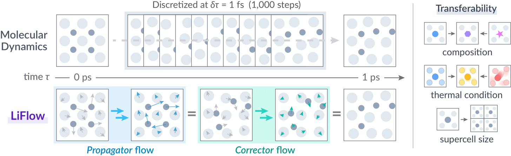

# LiFlow

[](https://arxiv.org/abs/2410.01464)
[](https://zenodo.org/doi/10.5281/zenodo.14889760)
[](https://opensource.org/license/mit)

This repository implements a generative framework to accelerate molecular dynamics simulations for crystalline materials.
We enable the propagation of atomic configurations in time by learning a distribution of displacements from a set of reference trajectories.
The details of the method are described in the paper: [Flow Matching for Accelerated Simulation of Atomic Transport in Crystalline Materials](https://www.nature.com/articles/s42256-025-01125-4).

<p align="center">

</p>
<p align="center">

</p>

## Setup

Clone the repository, create a new environment and install the required packages:

```bash
# Clone the repository
git clone https://github.com/learningmatter-mit/liflow.git

# Create conda environment
conda create -n liflow python=3.11
conda activate liflow

# Install torch (change the CUDA version if needed)
pip install torch==2.5.1 --index-url https://download.pytorch.org/whl/cu124
pip install torch-scatter -f https://data.pyg.org/whl/torch-2.5.1+cu124.html

# Install liflow
pip install -e .
# pip install -e '.[dev]'  # additional packages for development
```

## Usage

This section provides a brief overview of the training and evaluation process.
We assume that the dataset is stored in the `data/` directory, and the scripts are executed from the root directory of the repository.

### Dataset

To reproduce the results in the paper, download the dataset from [here](https://doi.org/10.5281/zenodo.14889658) and extract it to the `data/` directory.

```bash
mkdir data
tar -xvf data.tar.gz -C data
```

We provide the datasets for the universal MLIP set and LGPS dataset.
LGPS trajectories are obtained from XDATCAR files provided in the [Inorganic Solid State Electrolytes Database](https://superionic.upc.edu).
LPS dataset are obtained from the authors of [[Jun et al., 2024]](https://www.pnas.org/doi/10.1073/pnas.2316493121), and are available upon request.

The data directories contain the following files:

| File | Description |
|------|-------------|
| `element_index.npy` | Element indices for the atomic species `[n_elements,]` |
| `atomic_numbers.npy` | Atomic numbers for atoms in the structures, dictionary of `[n_atoms,]` int arrays indexed by `name` |
| `lattice.npy` | Lattice matrix for the structures, dictionary of `[3, 3]` float arrays indexed by `name` |
| `positions_{temp}K.npz` | Atomic positions for the structures at the specified temperature, dictionary of `[n_frames, n_atoms, 3]` float arrays indexed by `name` |
| `{train,test}_{temp}K.csv` | Index CSV files for the training and testing trajectories (see below) |

### Training

The CSV files in the dataset contain the necessary information to load the trajectories.
The columns are as follows:

| Column | Description |
|--------|-------------|
| `name` | Identifier of the structure |
| `temp` | Temperature of the trajectory |
| `t_start` | Starting time of the trajectory |
| `t_end` | Ending time of the trajectory |
| `comp` | Composition of the structure (used to split and sample the dataset) |
| `msd_t_Li` | MSD/time for lithium atoms in Ų/ps (train split for universal MLIP set) |
| `msd_t_frame` | MSD/time for frame atoms in Ų/ps (train split for universal MLIP set) |
| `prior_Li` | Prior label (0 or 1) for lithium atoms |
| `prior_frame` | Prior label (0 or 1) for frame atoms |

For the universal MLIP set, `prior_Li` and `prior_frame` labels are obtained by training a classifier based on the MSD values of the training set.
Please refer to the notebook `notebooks/prior_classifier.ipynb` for the details.
For the LGPS and LPS datasets, the prior labels are annotated based on the MSD values from the short training trajectories.

Training scripts are provided in the `scripts/` directory, and the training is performed using `liflow.experiment.train` module.
The arguments are specified by the hydra configuration file `liflow/configs/train.yaml`, and can be overridden from the command line as in the provided examples.
The important arguments are:

| Argument | Description |
|----------|-------------|
| `task` | Training task (propagate or correct) |
| `name` | Name of the experiment, checkpoints will use this name |
| `data.data_path` | Path to the dataset |
| `data.index_files` | List of index CSV files to load the trajectories |
| `data.train_valid_split` | Whether to split the validation set from the training set (True for universal set, False for LGPS and LPS) |
| `data.sample_weight_comp` | Whether to sample the dataset inversely proportional to the composition count (to sample over compositions uniformly) |
| `data.in_memory` | Whether to load the dataset in memory (useful for small datasets) |
| `propagate_prior.params.scale` | Scale hyperparameters for the propagator prior (`[[Li_small, Li_large], [frame_small, frame_large]]`) |
| `correct_noise.params.scale` | Corrector noise scale |

We provide the trained model checkpoints in the `checkpoints/` directory.
The checkpoints are named as `{P,C}_{dataset}.ckpt`, where `P` and `C` denote the propagator and corrector models, respectively.
LGPS corrector models are trained with different noise scales (0.1 and 0.2), and the checkpoints are named as `C_LGPS_{0.1,0.2}.ckpt`.

### Testing

The testing scripts are also provided in the `scripts/` directory.
The testing for the universal MLIP set is performed using `liflow.experiment.test` module, and generates a CSV file with the metrics reported in the paper.

To generate the trajectories for the LGPS and LPS datasets, we wrote a standalone script to convert the output positions into a xyz file.
Example for the LGPS dataset is provided in `scripts/test_LGPS.py`.
The script will read the checkpoint file and initial structure from the dataset (e.g., POSCAR file for LGPS), and generate the trajectories at the specified temperature as a xyz file in the output directory.

## Citation

```bibtex
@article{nam2025flow,
  title={Flow Matching for Accelerated Simulation of Atomic Transport in Crystalline Materials},
  author={Juno Nam and Sulin Liu and Gavin Winter and KyuJung Jun and Soojung Yang and Rafael G{\'o}mez-Bombarelli},
  journal={Nature Machine Intelligence},
  year={2025},
  doi={10.1038/s42256-025-01125-4},
}
```
